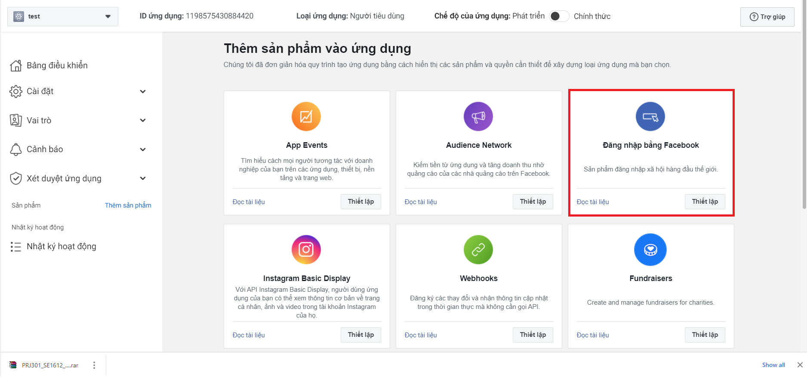

# Google

1. Install package

```js
yarn add @nestjs/passport passport passport-google-oauth20

yarn add @types/passport-google-oauth20 -D
```

2. Go to google console and create a token

- go to https://console.developers.google.com/
- create a project
- Click on Credentials --> Create Credentials --> Fullfill the form
- after these steps, you got your clientID and clientSecret

# Google

```js
yarn add @nestjs/passport passport passport-facebook

yarn add @types/passport-facebook -D
```

- go to https://developers.facebook.com/
- create a project and go to this project's console
- select login with facebook



- then fullfill the form then you will get your clientID and clientSecret

# Github

```js
yarn add @nestjs/passport passport passport-github2

yarn add @types/passport-github2 -D
```

- go to https://github.com/settings/applications/new
- create new OAuth application then you will get the clientID and secretID
